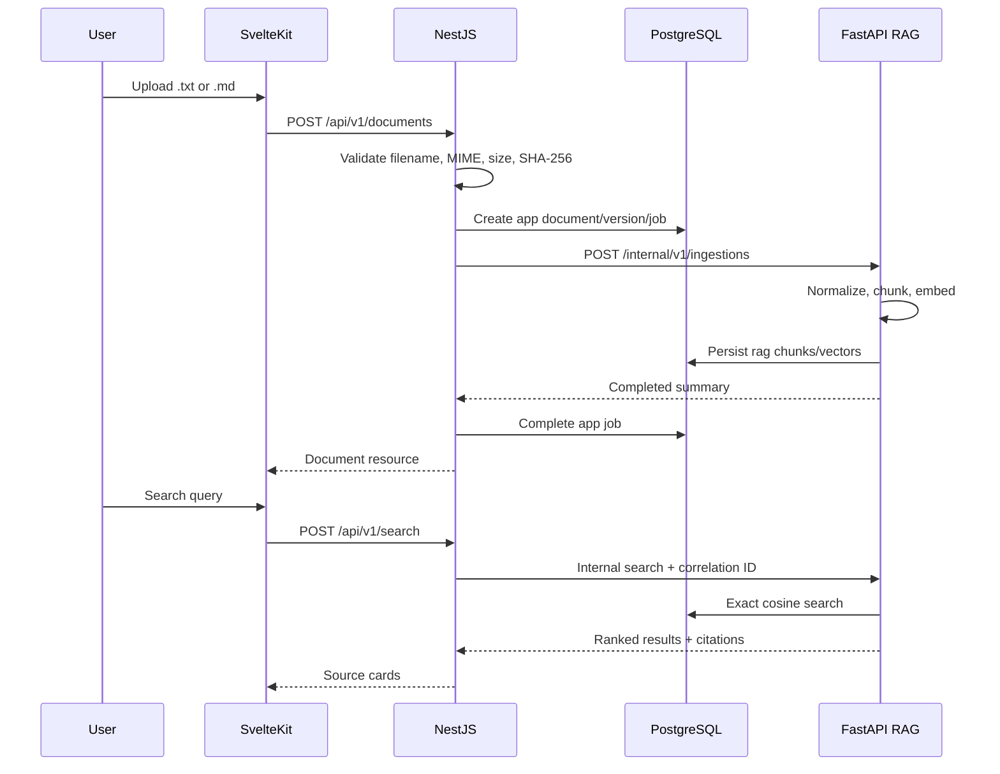

# Architecture — Sprint 1

## Decision context

Sprint 1 must turn controlled documents into traceable search results without coupling the browser to retrieval infrastructure or relying on a paid model provider. The architecture preserves the final platform boundaries while implementing only the Semantic Search module.

## Runtime view

```text
SvelteKit (presentation)
  -> NestJS /api/v1 (public application boundary)
       -> PostgreSQL app schema
       -> FastAPI /internal/v1 (private RAG boundary)
            -> PostgreSQL rag schema + pgvector
            -> replaceable document storage
            -> deterministic or OpenAI-compatible embedding adapter
```

Redis is provisioned and health-checked because it is part of the platform runtime, but Sprint 1 deliberately avoids cache, locks, streams, and queues until evidence justifies them.

## Ownership

| Boundary | Owns | Must not own |
|---|---|---|
| SvelteKit | interaction, accessible states, typed public resources | SQL, vector ranking, metric calculation |
| NestJS | public HTTP, validation, app metadata, orchestration, error mapping | embedding or vector ranking logic |
| FastAPI | canonicalization, chunking, embedding adapters, exact retrieval, citations | public browser policy, app metadata writes |
| PostgreSQL `app` | documents, versions, ingestion jobs | RAG implementation details |
| PostgreSQL `rag` | chunks, embedding versions, vectors, citations | public product workflow |

Cross-boundary work uses versioned HTTP contracts. NestJS never queries `rag` tables and FastAPI never mutates `app` tables.

## Main sequence



## Failure behavior

- validation failures return stable error codes before persistence;
- duplicate file hashes return the existing document resource;
- internal timeouts map to `RAG_SERVICE_TIMEOUT` and do not expose infrastructure URLs;
- a failed ingestion remains inspectable as a failed job;
- an unresolved citation returns a controlled 404;
- logs contain IDs and correlation IDs, never file contents, secrets, or complete queries.

## Sprint boundary

Evaluation datasets, retrieval metrics, ANN optimization, LangGraph, tools, traces, SSE, and security-evaluation runs are intentionally absent. Their folders and APIs are not scaffolded prematurely.
