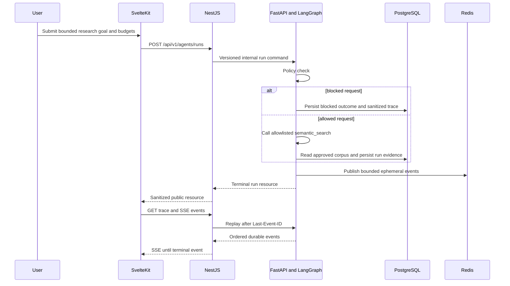

# Architecture — Sprints 1–3

## Decision context

The platform must make retrieval quality and bounded agent execution inspectable without coupling the browser to vectors, workflow internals, or a paid model provider. Sprint 3 extends the existing retrieval boundaries with one read-only research workflow; it does not introduce an autonomous chat agent.

## Runtime view

```text
SvelteKit (presentation)
  -> NestJS /api/v1 (public application boundary and SSE)
       -> PostgreSQL app schema
       -> FastAPI /internal/v1 (private RAG and agent boundary)
            -> PostgreSQL rag schema + pgvector
            -> PostgreSQL agent schema
            -> LangGraph bounded-research-v1
            -> allowlisted read-only tools
            -> Redis Stream (ephemeral event fan-out)
```

PostgreSQL is the durable source of truth. Redis contains a namespaced, length-bounded, one-hour event stream and is never the only copy of a run, step, call, event, or checkpoint.

## Ownership

| Boundary | Owns | Must not own |
|---|---|---|
| SvelteKit | interactions, run form, run list, graph and ordered trace presentation | SQL, retrieval, workflow routing, metric or policy calculation |
| NestJS | public HTTP, validation, correlation, error mapping and SSE replay | embeddings, tool execution, LangGraph state or trace fabrication |
| FastAPI | ingestion, retrieval, evaluation, policy, graph execution, tools, sanitization and trace production | browser policy, public metadata writes or private reasoning |
| PostgreSQL `app` | documents, versions and ingestion jobs | retrieval or agent implementation details |
| PostgreSQL `rag` | sources, chunks, vectors, citations and evaluation evidence | public workflow metadata |
| PostgreSQL `agent` | runs, steps, tool calls, ordered events and checkpoints | transient stream delivery |
| Redis | ephemeral `sf05:agent:runs:{run_id}:events` delivery with TTL | durable truth |

Cross-boundary work uses versioned HTTP contracts. NestJS never queries `rag` or `agent` tables directly, and FastAPI never mutates `app` tables.

## Bounded workflow



The graph has four explicit nodes: `policy_check`, `retrieve_evidence`, `assess_evidence`, and `finalize`. The visible trace describes observable execution only. It never stores or presents chain-of-thought.

## Reliability and security boundaries

- an idempotency key returns the same durable run rather than repeating work;
- `max_steps`, `max_tool_calls`, overall timeout and per-tool timeout are bounded contracts;
- tools are registered by allowlist, read-only and schema constrained;
- retrieved text is untrusted evidence and never becomes an instruction;
- trace payloads redact credential-shaped keys, bearer tokens, common secret canaries and email addresses;
- large result payloads are rejected before persistence;
- checkpoints follow every durable event, while Redis publication failure cannot invalidate the durable trace;
- terminal SSE events close the stream and `Last-Event-ID` replays only unseen events;
- cancellation is accepted only for a non-terminal run.

## Failure behavior

Validation and policy failures are explicit. Missing resources remain controlled 404 responses. A tool timeout produces a `budget_exhausted` terminal outcome; unexpected execution failures produce sanitized error codes and failed step/tool events. No exception exposes infrastructure URLs, SQL, secrets, document contents, or private reasoning.

## Release boundary

Sprint 3 contains one deterministic, evidence-bound workflow and three read-only tools. Multi-agent coordination, arbitrary tools, write actions, human approval execution, external LLM dependence, authentication and tenant isolation remain outside version 1.0.0. There is no Sprint 4 in this project.

## AWS portfolio deployment profile

```text
CloudFront
  -> private S3 SvelteKit origin
  -> protected Lambda Function URL
       -> NestJS public API :8080
       -> FastAPI private API 127.0.0.1:8100
       -> Neon PostgreSQL over TLS
```

The single Lambda image is a deployment unit rather than a domain merge. HTTP contracts, ownership and public/private boundaries remain unchanged. PostgreSQL persists documents, vectors, evaluations and agent traces. Redis is not provisioned in AWS because its only responsibility is transient fan-out; the public SSE endpoint can replay ordered terminal evidence from PostgreSQL.

Lambda uses no provisioned concurrency. The deployment reserves one execution only when the regional quota can preserve AWS's documented unreserved minimum; restricted new accounts retain their smaller regional account cap without an invalid function reservation. CloudFront routes `/api/*` and `/healthz` to the IAM-protected function URL and serves all other client routes from private S3. Browser request bodies include an exact SHA-256 payload header required by the Lambda origin access control.
