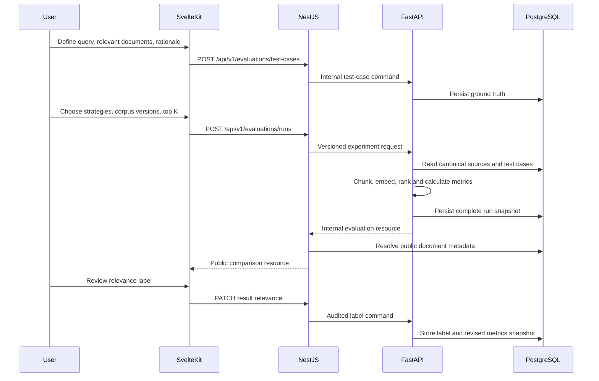

# Architecture — Sprints 1–2

## Decision context

The platform must expose traceable search and retrieval-quality evidence without coupling the browser to vector infrastructure or a paid model provider. Sprint 2 extends the established Sprint 1 boundaries; it does not introduce an agent runtime.

## Runtime view

```text
SvelteKit (presentation)
  -> NestJS /api/v1 (public application boundary)
       -> PostgreSQL app schema
       -> FastAPI /internal/v1 (private retrieval boundary)
            -> PostgreSQL rag schema + pgvector
            -> canonical source snapshots
            -> retrieval evaluation engine
            -> deterministic or OpenAI-compatible embedding adapter
```

Redis remains provisioned and health-checked but is not a source of truth. Neither sprint introduces cache semantics without measured benefit.

## Ownership

| Boundary | Owns | Must not own |
|---|---|---|
| SvelteKit | interactions, test-set controls, comparison views, accessible states | SQL, chunking, ranking, metric calculation |
| NestJS | public HTTP, validation, metadata enrichment, orchestration, error mapping | embeddings, ranking, evaluation arithmetic |
| FastAPI | normalization, chunking, embeddings, exact retrieval, citations, strategies, metrics, run snapshots | public browser policy, app metadata writes |
| PostgreSQL `app` | documents, versions, ingestion jobs | retrieval implementation details |
| PostgreSQL `rag` | canonical sources, chunks, vectors, citations, test cases, evaluation runs, relevance-label audit | public product workflow |

NestJS never queries `rag` tables and FastAPI never mutates `app` tables. Cross-boundary work uses versioned HTTP contracts.

## Retrieval-evaluation sequence



## Reproducibility boundary

An evaluation run records the selected strategy IDs, test-case IDs, document versions, cutoff, correlation ID, complete ranked hits, and metric semantics. Strategy implementations are versioned by ID and deterministic chunking version. The same inputs under the same embedding version produce equivalent rankings and metrics, while run IDs and timing remain unique operational metadata.

## Failure behavior

- validation failures return stable public errors before an experiment starts;
- missing test cases, corpus sources, strategies, runs, or results return controlled errors;
- internal timeouts and availability failures do not expose infrastructure URLs;
- incomplete recall is retained as evidence rather than hidden;
- manual relevance changes are auditable and do not silently rewrite the original expected-document IDs;
- logs contain identifiers and correlation IDs, never document content, secrets, or full queries.

## Sprint boundary

Approximate-nearest-neighbor optimization, agent graphs, tools, traces, SSE, human approval workflows, and security-evaluation suites remain outside Sprint 2. Sprint 3 has not been started.
